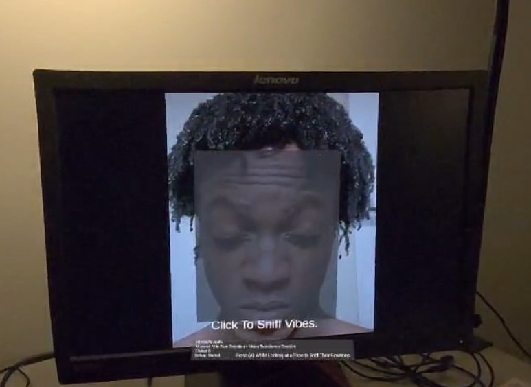
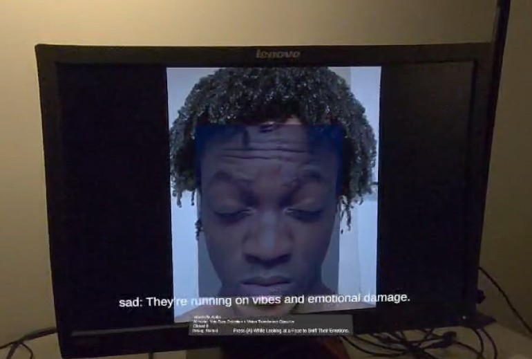

# VibeSniffa

VibeSniffa is a unity XR application built for the Meta Quest 3, it allows the user to look at others and in real-time it detects faces around the user, then the user can easily select a face which has their emotions classified into one of seven options. The emotion is then shown along with a witty line about the user's emotional state.

# Architecture
The app can be separated into two systems, the VR application which interfaces with the Quest's passthrough cameras and controllers, and the AI service, which runs all the necessary models.

# Further Info
More information can be found in the codebase and in the provided presentation.
